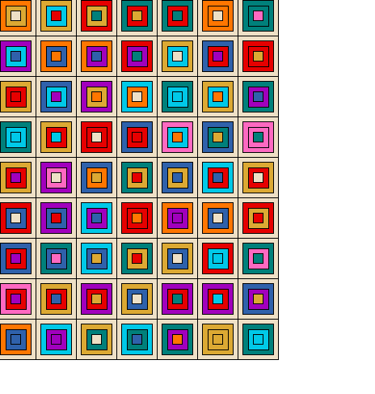

# List of words that have lost all meaning because I have typed them too many times in this project
- Color
- Choice
- Square

I already took the time to work out the Amma layout by type and they have random colors. I'll use this for now out of sheer laziness. 

I made a stupid algorithm that goes through each square and randomly chooses a color for rectangle 2. It works!
```python
def blanket_algorithm(blanket):
    color_list = list(Color) #generate a list so we can use random integers to select a color
    square_count = 0
    # this is a stupid algorithm that only generates random color patterns
    for row in blanket:
        for square in row:
            choice = random.randint(0,7) #only choose between non base colors
            color_choice = color_list[choice]
            square.rect2.set_color(color_choice.value)
            square_count += 1
    return blanket
```

Next up, doing it for rectangle 3 and 4. I am going to add logic to the algorithm that won't modify rectangle 4 of Amma.SAGA but really I should protect that elsewhere

This stupid algorithm randomly assigns colors to all appropriate squares! It's not perfect though.

```python
def blanket_algorithm(blanket):
    color_list = list(Color) #generate a list so we can use random integers to select a color
    # this is a stupid algorithm that only generates random color patterns
    for row in blanket:
        for square in row:
            choice_1 = random.randint(0,7) #only choose between non base colors
            choice_2 = random.randint(0,7)
            choice_3 = random.randint(0,7)
            color_choice_1 = color_list[choice_1]
            color_choice_2 = color_list[choice_2]
            color_choice_3 = color_list[choice_3]
            square.rect2.set_color(color_choice_1.value)
            square.rect3.set_color(color_choice_2.value)
            if square.amma != Amma.SAGA: #TODO: move this logic elsewhere
                square.rect4.set_color(color_choice_3.value)

    return blanket
```

This screenshot shows that sometimes we still see squares where the same color can occur twice in a square, which is a no-no



Now, let's remove the possibility that the same color can be in the same square. Instead of using `random.randint` I'm going to use `random.choice()` on the list of values from 0-7 and I will pop values from that list in between each choice.

```python
def blanket_algorithm(blanket):
    color_list = list(Color) #generate a list so we can use random integers to select a color
    # this is a stupid algorithm that only generates random color patterns
    for row in blanket:
        for square in row:
            choices = [0,1,2,3,4,5,6,7]
            choice_1 = random.choice(choices) #only choose between non base colors
            choices.remove(choice_1)
            choice_2 = random.choice(choices)
            choices.remove(choice_2)
            choice_3 = random.choice(choices)
            color_choice_1 = color_list[choice_1]
            color_choice_2 = color_list[choice_2]
            color_choice_3 = color_list[choice_3]
            square.rect2.set_color(color_choice_1.value)
            square.rect3.set_color(color_choice_2.value)
            if square.amma != Amma.SAGA: #TODO: move this logic elsewhere
                square.rect4.set_color(color_choice_3.value)

    return blanket
```

This does the trick! However, I'm directly setting the color in the underlying Rectangle class which then doesn't change the name of the color. I should probably override the superclass of Rectangle for the set_color method to set the color, reset the color name, and to check for Amma SAGA status.
Eh, or I can just change the color name. Lazy Leah is going to do that because overriding is weird when I have a Shape of multiple Shapes. 

I took a break from the algorithm and I just spent a lot of time updating the hex values to more accurately represent the yarns I think I'm going to use which are from [Scheepjes Stone washed](https://www.scheepjes.com/en/stone-washed-440/) and [Scheepjes River Washed](https://www.scheepjes.com/en/river-washed-2317/)

There are a few directions I could go beyond pure randomess for the algorithm. Right now, the counts of color distribution are relatively even overall. Ideally, they're even-ish for each row. Let's start with a visual layout of the types of Amma squares and then puzzle this out with the facts we know:

### Visual Layout of Amma distribution


- There are 63 squares in the blanket, each of which has 4 subsquares with color - rect1, rect2, rect3, rect4. This technically means that there are 252 squares within squares total (63*4)
- All rect1s are the Base color, a tan color. This mean there are 63 rect1s that are `Color.BASE`. This leaves 189 subsquares total to care about
- All Amma squares of type Saga (`Amma.SAGA`) have an innermost subsquare (rect4) of `Color.BASE`. There are 12 `Amma.SAGA` squares in this layout. This leaves 177 squares to care about
- There are 8 non-base colors in the colorway. This means that in an ideal world, assuming I treat all subsquares equally[^1], there should be approximately 22 of each color in total split between rect2s, rect3s, rect4s. 
- I probably want an even split betwen rect2s, rect3s, rect4s, which means roughly 7 in each of those

I have more opinions about color distribution - for example, I don't think there should be two identical squares, or two squares with rect2s that are identical touching, but that's for future Leah to explore. This is enough to go off of for now with what I have.

[^1]: This is a big assumption. Some subsquares are larger than others and it may not be an aesthetically pleasing strategy to treat rect2s equal to rect4s, which theoretically have less. However, this pattern is not actually concentric squares but features varying intricate mosaic patterns, so this actually might not be a horrible assumption. If this were granny squares though, this is not the best assumption. 

Made `even_distro_blanket_algorithm` - the initial version operates under the assumptions from above and makes sure there's no more than 23 subsquares of any given color. It does not yet try to even out distribution by level of subsquare though. The image below shows output from this algorithm


The counts for each are as follows (maybe I'll format this prettier someday) - items to note are the majority of orange squares are in rect3, and that there are 23 of multiple colors but only 19 purple. Ideally that wouldn't happen. 

```python
rect2 counts: {'PINK': 8, 'TEAL': 8, 'CURRY': 10, 'RUSTIC_RED': 5, 'PURPLE': 10, 'ORANGE': 6, 'TURQUOISE': 6, 'ROYAL_BLUE': 10}
rect3 counts: {'RUSTIC_RED': 9, 'CURRY': 9, 'PINK': 5, 'TURQUOISE': 8, 'TEAL': 6, 'PURPLE': 6, 'ROYAL_BLUE': 8, 'ORANGE': 12}
rect4 counts:{'BASE': 12, 'TEAL': 6, 'ROYAL_BLUE': 5, 'RUSTIC_RED': 9, 'TURQUOISE': 9, 'PINK': 10, 'CURRY': 4, 'ORANGE': 5, 'PURPLE': 3}
totals: {'PINK': 23, 'TEAL': 20, 'CURRY': 23, 'RUSTIC_RED': 23, 'PURPLE': 19, 'ORANGE': 23, 'TURQUOISE': 23, 'ROYAL_BLUE': 23, 'BASE': 12}
```

I think my next step is to try to even things out by making sure the inner rects have limits too. Beyond that, I might start needing to think about this as a tree or graph and modify the data structure to properly traverse it.

Actually, my first stop is going to be to remove the 23 limit and only try doing the inner limit of 8 on each color. Ok, it works fine. However, the limit probably needs to not be 8 on the inner one because we'll have the 12 bases always. It should be 7.

This works kind of ok, though it depends on how the distribution goes. I also want to add logic so no two squares are identical. 

To do equals
- make a comparison function that checks equality of the colors within. 
- store squares in a dict
- when you make a new square, check dict before proceeding

track square and check for dupes are kind of messed up and the weird three number key isn't working great. 

Update - back at it about 10 weeks later. This recursion was broken because I was never getting the exception I wanted in my try except. I fixed the recursion error, and now I need to fix the drawing. 

Okay so cool recursion error is fixed when I just calculate, but when I go to draw, it's back? Mysteries abound. Something about the paper.display() function is causing problems. Okay no recursion error - but it's not drawing correctly. I tried running shapes directly and it's showing up all black. I'm also getting a system tk warning which is bad. This might be an apple silicon thing. Ugh. Going to try with Python 3.8 instead of Python 3.9. Oh, no, [Python docs](https://www.python.org/download/mac/tcltk/#activetcl-8-5-18-0) say I should do python 3.9.8 or later - I was previously using Python 3.9.1. 

Hmm, no change. Right now when I try to run `python shapes.py` I just see black, same with my blanket. Is this a weird dark mode thing? No. it's not. It looks like I'm running tkinter 8.5 with pyenv. How can I force it to go 8.6? Ugh, I can with homebrew. [Thanks, Stackoverflow](https://stackoverflow.com/questions/60469202/unable-to-install-tkinter-with-pyenv-pythons-on-macos)