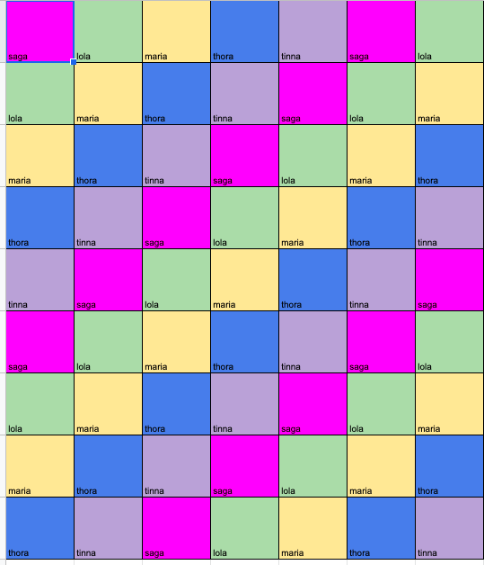

# Ideas
1. create a base ammadict with fixed Amma types defined but colors left blanket
1. use premade amma, convert to dict, modify, pass back as obj
1. use premade amma, modify obj directly

# List of words that have lost all meaning because I have typed them too many times in this project
- Color
- Choice
- Square

## use premade amma, modify obj directly

I already took the time to work out the Amma layout by type and they have random colors. I'll use this for now out of sheer laziness. 

I made a stupid algorithm that goes through each square and randomly chooses a color for rectangle 2. It works!
```python
def blanket_algorithm(blanket):
    color_list = list(Color) #generate a list so we can use random integers to select a color
    square_count = 0
    # this is a stupid algorithm that only generates random color patterns
    for row in blanket:
        for square in row:
            choice = random.randint(0,7) #only choose between non base colors
            color_choice = color_list[choice]
            square.rect2.set_color(color_choice.value)
            square_count += 1
    return blanket
```

Next up, doing it for rectangle 3 and 4. I am going to add logic to the algorithm that won't modify rectangle 4 of Amma.SAGA but really I should protect that elsewhere

This stupid algorithm randomly assigns colors to all appropriate squares! It's not perfect though.

```python
def blanket_algorithm(blanket):
    color_list = list(Color) #generate a list so we can use random integers to select a color
    # this is a stupid algorithm that only generates random color patterns
    for row in blanket:
        for square in row:
            choice_1 = random.randint(0,7) #only choose between non base colors
            choice_2 = random.randint(0,7)
            choice_3 = random.randint(0,7)
            color_choice_1 = color_list[choice_1]
            color_choice_2 = color_list[choice_2]
            color_choice_3 = color_list[choice_3]
            square.rect2.set_color(color_choice_1.value)
            square.rect3.set_color(color_choice_2.value)
            if square.amma != Amma.SAGA: #TODO: move this logic elsewhere
                square.rect4.set_color(color_choice_3.value)

    return blanket
```

This screenshot shows that sometimes we still see squares where the same color can occur twice in a square, which is a no-no


Now, let's remove the possibility that the same color can be in the same square. Instead of using `random.randint` I'm going to use `random.choice()` on the list of values from 0-7 and I will pop values from that list in between each choice.

```python
def blanket_algorithm(blanket):
    color_list = list(Color) #generate a list so we can use random integers to select a color
    # this is a stupid algorithm that only generates random color patterns
    for row in blanket:
        for square in row:
            choices = [0,1,2,3,4,5,6,7]
            choice_1 = random.choice(choices) #only choose between non base colors
            choices.remove(choice_1)
            choice_2 = random.choice(choices)
            choices.remove(choice_2)
            choice_3 = random.choice(choices)
            color_choice_1 = color_list[choice_1]
            color_choice_2 = color_list[choice_2]
            color_choice_3 = color_list[choice_3]
            square.rect2.set_color(color_choice_1.value)
            square.rect3.set_color(color_choice_2.value)
            if square.amma != Amma.SAGA: #TODO: move this logic elsewhere
                square.rect4.set_color(color_choice_3.value)

    return blanket
```

This does the trick! However, I'm directly setting the color in the underlying Rectangle class which then doesn't change the name of the color. I should probably override the superclass of Rectangle for the set_color method to set the color, reset the color name, and to check for Amma SAGA status.
Eh, or I can just change the color name. Lazy Leah is going to do that because overriding is weird when I have a shape of multiple shapes. 

I just spent a lot of time updating the hex values to more accurately represent the yarns I think I'm going to use which are from [Scheepjes Stone washed](https://www.scheepjes.com/en/stone-washed-440/) and [Scheepjes River Washed](https://www.scheepjes.com/en/river-washed-2317/)

There are a few directions I could go beyond pure randomess for the algorithm. Right now, the counts of color distribution are relatively even overall. Ideally, they're even-ish for each row. Let's start with a visual layout of the types of Amma squares and then puzzle this out with the facts we know:

Visual Layout of Amma distribution


- There are 63 squares in the blanket, each of which has 4 subsquares with color - rect1, rect2, rect3, rect4. This technically means that there are 252 squares within squares total (63*4)
- All rect1s are the Base color, a tan color. This mean there are 63 rect1s that are `Color.BASE`. This leaves 189 subsquares total to care about
- All Amma squares of type Saga (`Amma.SAGA`) have an innermost subsquare (rect4) of `Color.BASE`. There are 12 `Amma.SAGA` squares in this layout. This leaves 177 squares to care about
- There are 8 non-base colors in the colorway. This means that in an ideal world, assuming I treat all subsquares equally[^1], there should be approximately 22 of each color in total split between rect2s, rect3s, rect4s. 
- I probably want an even split betwen rect2s, rect3s, rect4s, which means roughly 7 in each of those

I have more opinions about color distribution - for example, I don't think there should be two identical squares, or two squares with rect2s that are identical touching, but that's for future Leah to explore. This is enough to go off of for now with what I have.

[^1]: This is a big assumption. Some subsquares are larger than others and it may not be an aesthetically pleasing strategy to treat rect2s equal to rect4s, which theoretically have less. However, this pattern is not actually concentric squares but features varying intricate mosaic patterns, so this actually might not be a horrible assumption. If this were granny squares though, this is not the best assumption. 